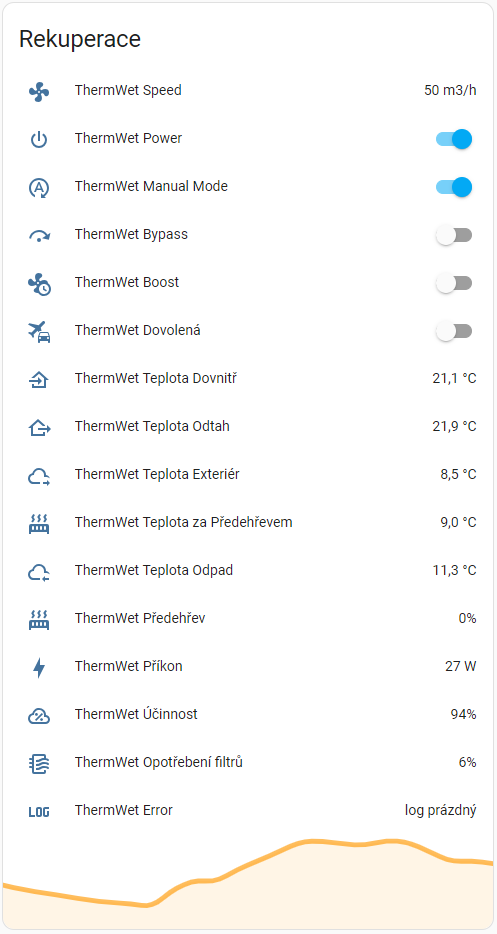

# HA-ThermWet
Home Assistant ThermWet Ventbox integration using rest

This is a set of basic [Home Assistant](https://www.home-assistant.io/) RESTful [sensors](https://www.home-assistant.io/integrations/sensor.rest/) and [switches](https://www.home-assistant.io/integrations/switch.rest/) to control [ThermWet](https://www.thermwet.cz/) unit using it's built in web interface.

Tested with Ventbox II 300 Premium, firmware 2.440

